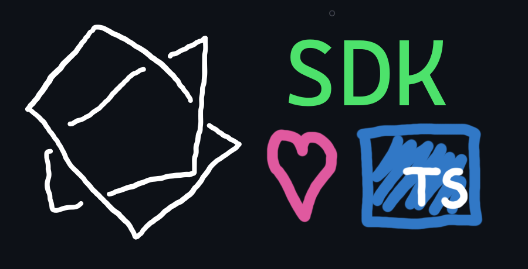

<div align="center">
   
   <br/>
   <i>A sound way to interact with Axel's API!</i>
</div>

```bash
npm install github:axel-hq/sdk-v0
```

```js
const {Client} = require("@axel-hq/sdk");
const axel = new Client("axlu-1-0123abcd");

await axel.connect_provider();
axel.lend({protocol: "aave", token: "ETH", amount: .001});
```
